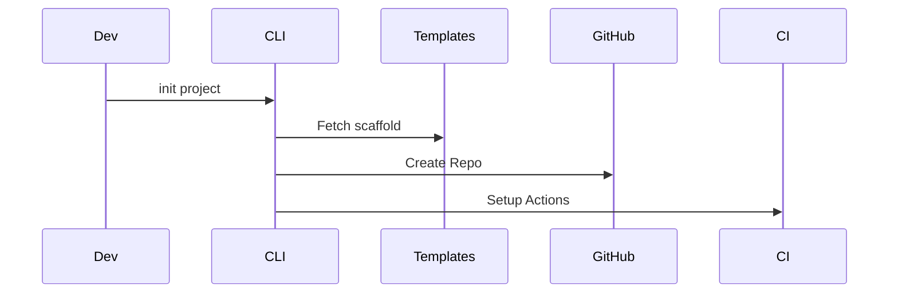

# golden-path-cli Architecture

## System Diagram
The following Mermaid.js sequence diagram maps the core workflow and interactions:

## Component Breakdown
- **Core Technology**: Go, Cobra
- **Design Paradigm**: Emphasizes high availability, fault tolerance, and security.

## Security & Scaling Considerations
- Strict boundary validations.
- Horizontal scalability achieved via stateless workers.
- Encrypted data at rest and in transit.
