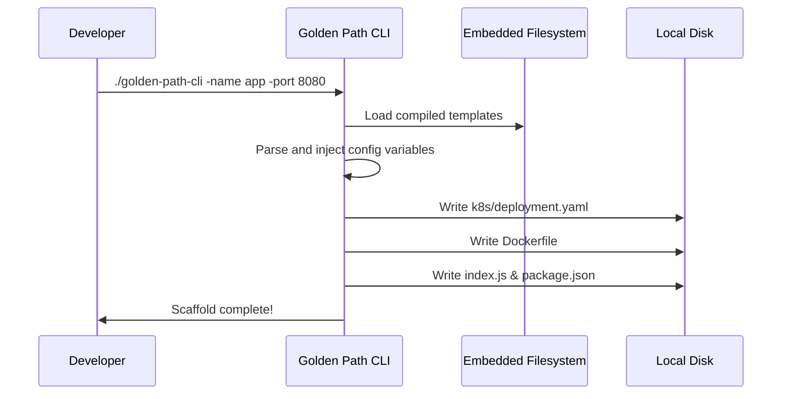

# Golden Path CLI Architecture
> Maturity: Full Prototype

## Overview
The `golden-path-cli` is a Go-based standalone executable designed for Platform Engineering teams to scaffold secure, standardized microservices. Instead of distributing templates as separate files, the templates are baked directly into the compiled binary using Go's `embed` package, ensuring the tool is highly portable.

## System Diagram
The following Mermaid.js sequence diagram maps the core workflow and interactions:

## Component Breakdown
- **Core Technology**: Go (1.21+), `embed.FS`, `text/template`
- **Output Artifacts**: Express API, Distroless Dockerfile, Kubernetes manifests, GitHub Actions CI.
- **Design Paradigm**: Emphasizes secure-by-default boilerplate, removing cognitive load from developers.

## Security Considerations
- **Immutable Templates**: By embedding templates into the binary at compile time, they cannot be tampered with or accidentally modified on the local machine before generation.
- **Zero-Trust Defaults**: Generated Kubernetes manifests enforce `runAsNonRoot: true`, `readOnlyRootFilesystem: true`, and drop all capabilities to prevent container escapes.
